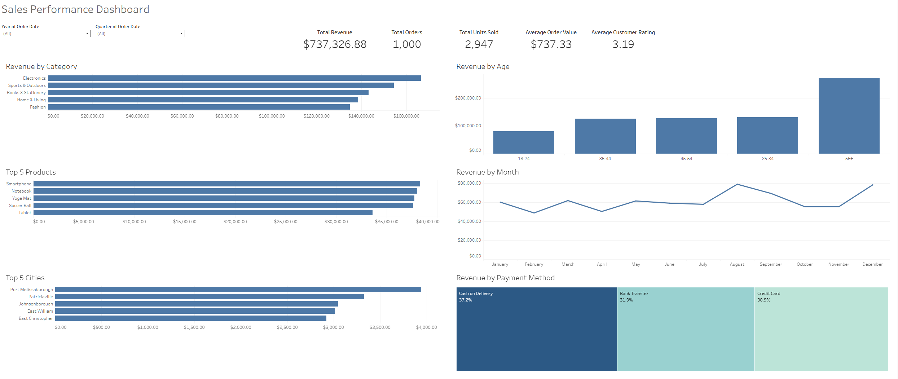

# ecommerce-sales-analytics

## Author 
Nicholas Guthery  
Business Data Analytics Student  
W.P. Carey School of Business, Arizona State University 

## Project Overview
This project analyzed e-commerce sales data to identify factors influencing revenue generation and customer purchasing behavior. Microsoft Excel was used for data cleaning, KPI calculations, and PivotTable analysis, while Tableau was used to develop an interactive dashboard.
Using Excel and Tableau, the dataset was cleaned, transformed, and analyzed to answer key business questions related to sales performance and customer behavior.

## Business Problem
Businesses rely on data to understand customer purchasing patterns and optimize sales and marketing strategies. This project explores:

- Which product categories generate the most revenue?
- Which products are the top performers in terms of revenue?
- Which cities generate the highest revenue?
- How does revenue vary across customer age groups?
- How does revenue change throughout the year?
- What payment methods are most commonly used by customers?

## Dataset
The dataset contains retail sales transaction data, including:

- Customer information
- Product information
- Order details
- Revenue data
- Payment methods
- Geographic information
  
## Key Variables
| Variable       | Description                            |
| -------------- | -------------------------------------- |
| customer_id    | Unique identifier for each customer    |
| order_date     | Date the order was placed              |
| product_id     | Unique identifier for each product     |
| product_name   | Product purchased                      |
| category_name  | Product category                       |
| quantity       | Number of units purchased              |
| price          | Revenue generated from the transaction |
| payment_method | Payment method used                    |
| city           | Customer city                          |
| age            | Customer age                           |

## Tools Used
- Microsoft Excel
  - Data cleaning
  - Data transformation
  - PivotTables
  - Exploratory analysis
- Tableau
  - Dashboard development
  - Data visualization
  - Interactive reporting
 
## Project Workflow
## 1. Data Cleaning
The raw dataset was reviewed and cleaned by:
- Removing inconsistencies
- Standardizing formats
- Validating data quality
- Preparing the dataset for analysis
  
## 2. Exploratory Data Analysis
PivotTables were used to analyze:
- Revenue by product category
- Revenue by product
- Revenue by city
- Revenue by age group
- Revenue by payment method
- Revenue trends over time

## 3. Dashboard Development
A Tableau dashboard was created to provide an interactive view of:
- Revenue by Category
- Top Products
- Top Cities
- Revenue by Age Group
- Revenue by Month
- Revenue by Payment Method

## Dashboard Preview

## Key Findings
- Electronics is the strongest-performing product category.
- Fashion and Home & Living generated lower revenue than other categories.
- Customers aged 55+ contributed the largest share of revenue.
- Customers aged 18–24 contributed the smallest share of revenue.
- Revenue exhibited seasonal fluctuations throughout the year.
- Cash on Delivery was the most commonly used payment method.

## Repositry Structure
Ecommerce-Sales-Analytics/  
│  
├── dashboard/  
│   ├── README.md  
│   ├── clean_synthetic_online_retail_data.csv  
│   └── messy_synthetic_online_retail_data.csv  
│
├── excel/  
│   ├── README.md  
│   └── pivot_synthetic_online_retail_data.xlsx  
│
├── images/  
│   ├── README.md  
│   ├── revenue_by_age.png  
│   ├── revenue_by_category.png  
│   ├── revenue_by_month.png  
│   ├── revenue_by_age_group.png  
│   ├── revenue_by_month.png  
│   ├── revenue_by_payment_method.png  
│   ├── sales_performance_dashboard.png  
│   ├── top_cities.png  
│   └── top_products.png  
│  
├── images/  
│   ├── dashboard_overview.png  
│   ├── revenue_by_category.png  
│   ├── top_5_products.png  
│   ├── top_5_cities.png  
│   ├── revenue_by_age_group.png  
│   ├── revenue_by_month.png  
│   └── revenue_by_payment_method.png  
│  
└── reports/  
│   ├── README.md  
│   ├── Sales Performance Analytics Report.pdf 
│   ├── Sales Performance Analytics Case Study.pdf   
│   └── Sales Performance Data Cleaning Report.pdf  
│ 
├── README.md  

## Skills Demonstrated
- Data Cleaning
- Data Transformation
- Exploratory Data Analysis (EDA)
- PivotTables
- Data Visualization
- Dashboard Design
- Business Analysis
- KPI Development
- Storytelling with Data
